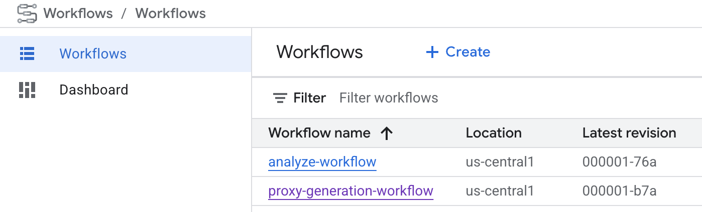
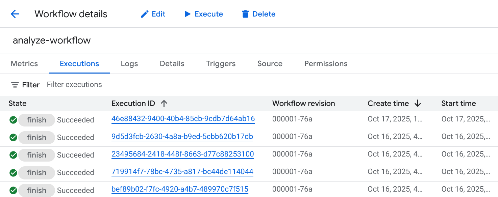
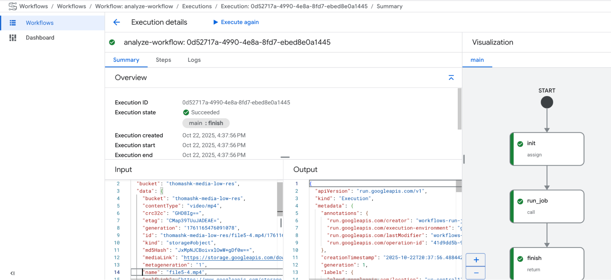
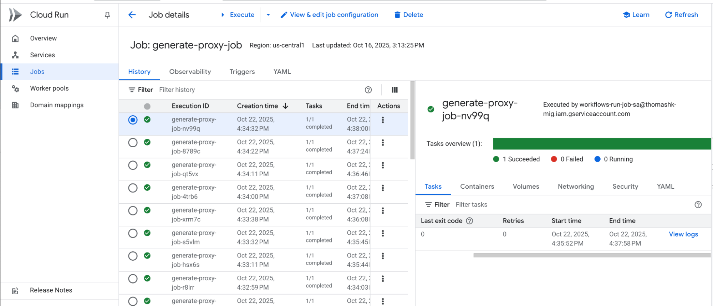
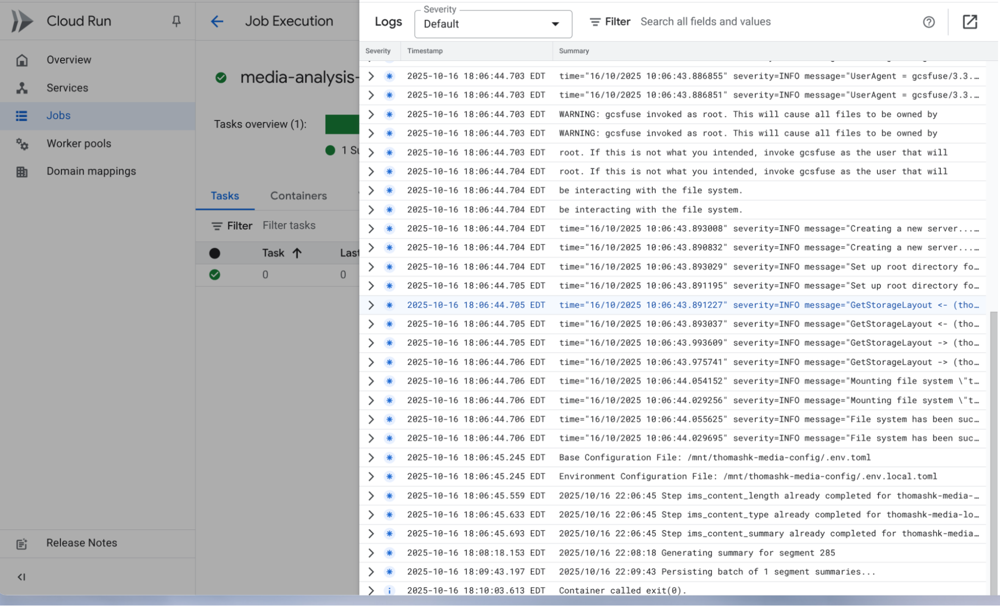

<!--
 Copyright 2025 Google, LLC
 
 Licensed under the Apache License, Version 2.0 (the "License");
 you may not use this file except in compliance with the License.
 You may obtain a copy of the License at
 
     https://www.apache.org/licenses/LICENSE-2.0
 
 Unless required by applicable law or agreed to in writing, software
 distributed under the License is distributed on an "AS IS" BASIS,
 WITHOUT WARRANTIES OR CONDITIONS OF ANY KIND, either express or implied.
 See the License for the specific language governing permissions and
 limitations under the License.
-->
# Media Metadata Extraction & Search

## Overview

The Media Search Solution is a comprehensive, cloud-native application designed for organizations and developers who need to manage, analyze, and search large libraries of video content. By leveraging the power of Google Cloud and AI, this solution automates the entire process of video ingestion, metadata extraction, and intelligent analysis, making your video assets easily discoverable and queryable.

### What does it do?

When you deploy this solution, it sets up an automated pipeline on Google Cloud that:

1.  **Ingests Videos:** Watches for new video uploads to a designated Cloud Storage bucket.
1.  **Processes Media:** Automatically creates low-resolution proxy versions for efficient playback and analysis.
1.  **Extracts Intelligence:** Triggers Cloud Run jobs orchestrated by Cloud Workflows to analyze video content using Google's Gemini models and extract rich metadata, such as object detection, segment descriptions, and key topics.
1.  **Persists Data:** Stores all extracted metadata and analysis results in a structured BigQuery dataset.
1.  **Enables Search:** Deploys a secure web application on Cloud Run that allows users to perform powerful, AI-driven searches across the entire video library.

The end result is a fully functional, searchable video archive that transforms your raw video files into a valuable, queryable data source.

### Who is this for?

This solution is ideal for:

*   **Media & Entertainment companies** looking to catalog and search their vast archives of video content. These include specific sectors such as:
    -  News organizations
    -  Sports entities
    -  Film and television production companies
*   **Marketing and advertising agencies** needing to analyze video campaigns and identify trends.
*   **Developers or organizations** with substantial video libraries who are looking to build or enhance AI-powered search and analysis capabilities, especially those who prefer a "build" approach for greater control and customization.

### Technical Design

The processing pipeline is event-driven, triggered by file uploads to Cloud Storage. It uses Cloud Workflows to orchestrate a series of serverless Cloud Run Jobs for tasks like proxy generation and AI-based media analysis. This provides a robust and scalable architecture for handling media processing. The web front-end is a separate service running on Cloud Run.

## Project History

This Media Search Solution originated from the work of Ryan McGuinness,
available at: https://github.com/rrmcguinness/gcp-media-go.
It further incorporates modifications and enhancements by Jay Cherian and Gino Filicetti,
available at: https://github.com/jaycherian/gcp-go-media-search.

## Deployment Guide

This section provides step-by-step instructions for deploying the `Media Search Solution` on Google Cloud.

### Prerequisites
Before you begin, ensure you have an active Google Cloud project with billing enabled.

Once the project is set up, the identity deploying the Infrastructure-as-Code (IaC) resources needs the following [IAM Roles](https://cloud.google.com/iam/docs/roles-overview) on the target Google Cloud project:

**Note:** If you already have the broader role like `Owner` (`roles/owner`) or `Editor` (`roles/editor`) you can skip setting the specific role. However, best practices for security are to use least privilege, if so, follow these guidelines.

*   **Service Usage Admin** (`roles/serviceusage.serviceUsageAdmin`): To enable project APIs.
*   **Artifact Registry Admin** (`roles/artifactregistry.admin`): To create the container image repository.
*   **Storage Admin** (`roles/storage.admin`): To create Cloud Storage buckets.
*   **BigQuery Admin** (`roles/bigquery.admin`): To create the BigQuery dataset and tables.
*   **Service Account Admin** (`roles/iam.serviceAccountAdmin`): To create service accounts for Cloud Build and the Cloud Run service.
*   **Project IAM Admin** (`roles/resourcemanager.projectIamAdmin`): To grant project-level permissions to the newly created service accounts.
*   **Cloud Build Builder** (`roles/cloudbuild.builds.builder`): To run the build job that creates the container image.
*   **Cloud Run Admin** (`roles/run.admin`): To deploy the application to Cloud Run.
*   **IAP Policy Admin** (`roles/iap.admin`): To grant access to Application's web interface.

### Create infrastructure resources on Google Cloud
1. **Set up your environment.** To deploy the solution, you can use [Cloud Shell](https://shell.cloud.google.com/?show=ide%2Cterminal), which comes pre-installed with the necessary tools. Alternatively, if you prefer a local terminal, ensure you have installed and configured the following:
    * [Git CLI](https://github.com/git-guides/install-git)
    * [Install](https://cloud.google.com/sdk/docs/install) and [initialize](https://cloud.google.com/sdk/docs/initializing) the gcloud CLI
    * [Terraform](https://developer.hashicorp.com/terraform/tutorials/gcp-get-started/install-cli)

1. **Clone the repository.** In your terminal, clone the solution's source code and change into the new directory:
    ```sh
    git clone https://github.com/GoogleCloudPlatform/media-search-solution.git
    cd media-search-solution
    ```
1. **Set script permissions.** Grant execute permission to all the script files in the `scripts` directory:
    ```sh
    chmod +x scripts/*.sh
    ```

1. **Run the setup script.** This script automates the initial setup by checking for required tools, logging you into Google Cloud, enabling necessary APIs, and creating a `terraform.tfvars` file from the example.
    ```sh
    scripts/setup_terraform.sh
    ```
1. **Configure your deployment variables.** The setup script created the `build/terraform/terraform.tfvars` file. Open this file and set the values for the following variables:

    |Terraform variable|Description|
    |---|---|
    |project_id|Your Google Cloud project ID.|
    |high_res_bucket|A unique name for the Cloud Storage bucket that will store high-resolution media (e.g., "media-high-res-your-project-id").|
    |low_res_bucket|A unique name for the Cloud Storage bucket that will store low-resolution media (e.g., "media-low-res-your-project-id").|
    |config_bucket|A unique name for the Cloud Storage bucket that will store solution configuration files (e.g., "media-search-configs-your-project-id").|
    |region|(Optional) The Google Cloud region for deployment. Defaults to `us-central1`.|

1. **Navigate to the Terraform directory**:
    ```sh
    cd build/terraform
    ```
1. **Initialize Terraform**:
    ```sh
    terraform init
    ```
    **NOTE:** When using Cloud Shell, the `terraform init` command can sometimes fail due to insufficient disk space. If you encounter an out-of-disk-space error, please follow the [Clearing disk space guide](https://docs.cloud.google.com/shell/docs/quotas-limits#clearing_disk_space) to free up space before proceeding.
1. **Deploy the resources.** Apply the Terraform configuration to create the Google Cloud resources. You will be prompted to review the plan and confirm the changes by typing `yes`:
    ```sh
    terraform apply
    ```
    The provisioning process may take approximately 30 minutes to complete.

    **NOTE:** During deployment, you might encounter a transient permission error related to the Eventarc Service Agent. This is often due to a brief delay in IAM permission propagation. If this occurs, wait a few minutes and then re-run the `terraform apply` command to resolve the issue.

### Deploy the Media Search service on Cloud Run
After Terraform has successfully created the infrastructure and built the container image, the final step is to deploy the application to Cloud Run and configure its access policies.

1. **Run the deployment script.** From your project root directory, execute the deployment script:
    ```bash
    cd ../..
    scripts/deploy_media_search.sh
    ```
    This script automates the following steps:
    *   Deploys the container to Cloud Run using the configuration from your Terraform outputs.
    *   Configures Identity-Aware Proxy (IAP) to secure your application.
    *   Prompts you to add IAP access policies for users or domains to access the web application.
    *   Prompts you to grant permissions for users or domains to upload files to the high-resolution bucket and view files in the low-resolution bucket.

    The script takes approximately 5 minutes to complete. Once finished, it will output the URL for the Media Search application.

    **NOTE:** IAP for Cloud Run is in Preview. This feature is subject to the "Pre-GA Offerings Terms" in the General Service Terms section of the Service Specific Terms. Pre-GA features are available "as is" and might have limited support. For official IAP setup, follow the [Enable IAP for load balancer guide](https://cloud.google.com/iap/docs/enabling-cloud-run#enable-from-iap)

## Usage Guide

This guide walks you through the basic steps of using the Media Search solution after it has been successfully deployed.

### 1. Accessing the Media Search Application

Once the deployment script finishes, it will output the URL for your Media Search web application.

1.  Open a web browser and navigate to the URL provided by the `deploy_media_search.sh` script.

    Here is an example of the URL:
    ```
    you can now access your service at: https://media-search-594050280394.us-central1.run.app 
    ```

1.  You will be prompted to sign in with a Google account. Ensure you are using an account that has been granted "IAP-secured Web App User" permissions during the deployment step.

### 2. Testing the Video Processing Pipeline

To test the end-to-end processing workflow, you need to upload a video file to the high-resolution Cloud Storage bucket created during deployment.

#### 2.1. Uploading a Video

**Option 1:**  Run the following command to get a URL to the Google Cloud console. Navigate to the URL in a web browser and upload your video file through the UI.

```sh
echo "https://console.cloud.google.com/storage/browser/$(terraform -chdir="build/terraform" output -raw high_res_bucket)?project=$(terraform -chdir="build/terraform" output -raw project_id)"
```

**Option 2:**.  Use the `gsutil` command-line tool to upload a video file. Replace `<YOUR_VIDEO_FILE>` with the path to your video.

```sh
gsutil cp <YOUR_VIDEO_FILE> gs://$(terraform -chdir="build/terraform" output -raw high_res_bucket)/
```

Uploading a file to this bucket automatically triggers the video processing workflow.

#### 2.2. Monitoring the Workflow

You can monitor the progress of the video processing by viewing the execution logs of the Cloud Run Jobs. The following command will generate a URL to the Google Cloud console where you can view the jobs executions detail, and drill into exection logs.

- For the proxy generation job, run the following command:

```sh
echo "https://console.cloud.google.com/run/jobs/details/$(terraform -chdir="build/terraform" output -raw cloud_run_region)/generate-proxy-job/executions?project=$(terraform -chdir="build/terraform" output -raw project_id)"
```

- For the media analysis job, run the following command:

```sh
echo "https://console.cloud.google.com/run/jobs/details/$(terraform -chdir="build/terraform" output -raw cloud_run_region)/media-analysis-job/executions?project=$(terraform -chdir="build/terraform" output -raw project_id)"
```

Each entry in the list corresponds to the processing of a single video file. You can monitor the status of your jobs (e.g., `Succeeded`, `Failed`) directly from this list.
To identify which video a specific job processed and to view its detailed logs:
1. Click on an execution in the list to open its details page.
1. Navigate to the YAML tab and find the `INPUT_FILE` environment variable to see the path of the processed video file.
1. To view detailed logs, switch back to the `Tasks` tab and click `View Logs`. A key log entry to watch for in the analysis job is `Persisting batch of n segment summaries...`, which indicates that the video analysis is complete and the metadata is being written to BigQuery.

#### 2.3. Understanding the Workflow

Two distinct workflows are triggered:
1. Proxy-generation-workflow
2. Analyze-workflow

**Important:** For optimal performance and to minimize run time and the number of video segments, it is recommended that video durations remain between 45 minutes and 1 hour, if possible.

- The proxy generation workflow processes the submitted video, converting it into the appropriate format for the Analyze workflow. Upon completion, the processed file is stored in the low-resolution Google Cloud Storage Bucket, which then triggers the Analyze workflow.

- The Analyze workflow processes the formatted video generated by the proxy generation workflow, performing several key actions:
    The Vertex AI Gemini model identifies and segments video content based on the defined prompt segment definitions. Also the Gemini model generates a summary of the entire video and each individual segment. Additionally, the AI model extracts any attributes specified in the prompt.

To inspect the workflow, navigate to the Workflows page in the GCP console and click on the relevant workflow name.



Each of the media files uploaded shall trigger an individual workflow: 




#### 2.4. Troubleshooting the Workflow / Job

To ensure the workflow and its associated jobs execute correctly, without error, it is important to understand their core components.

To locate the file processed by the workflow, click on the execution ID. The name of the file being processed is found on Line 14 of the Input.



Troubleshooting the workflow / job:

To inspect the job, navigate to the Cloud Run page within the GCP console, then click on the workflow name. Users can review the job logs by clicking "View logs."





After reviewing the job / issue, One can trigger the rerun of the workflow. 

Go to the Execution detail page, click the “Execute again” 

The other method is to follow the [DeveloperSetup Doc](docs/DeveloperSetup.md) on how to **Manually trigger pipeline executions**

### 3. Searching for Media Content

Once the processing is finished, you can use the web application to search for content within your video.

1.  Navigate back to the Media Search application URL in your browser.
2.  In the search bar, enter a free-text query related to the content of the video you uploaded. For example, if your video contains a segment with a car, you could search for "car".
3.  The application will display a list of video segments that have a high correlation with your search term. You can play the specific segments and view segment descriptions directly in the browser.

**Note:** IAP permission changes can take up to 7 minutes to propagate. If you encounter a `You don't have access` page, please wait a few minutes and then refresh your browser.

**Note:** The first time the application loads content from Google Cloud Storage, Google's [Endpoint Verification](https://cloud.google.com/endpoint-verification/docs/overview) may prompt you to select a client certificate.
If this occurs, choose the certificate issued by `Google Endpoint Verification` from the list.

### 4. Customizing Media Analysis

The Media Search Solution is configured with general-purpose prompts for analyzing video content. However, to achieve the best results for your specific use case, it is highly recommended that you customize the AI prompts to align with the nature of your media library.

For example:
*   If you are analyzing **sports footage**, you might want to extract key plays, player names, and game statistics.
*   For **news reports**, you might focus on identifying speakers, locations, and key events.
*   For **product reviews**, extracting product names, features mentioned, and sentiment would be crucial.

By tailoring the prompts, you guide the AI to extract the most relevant and valuable metadata for your needs, which significantly enhances the accuracy and usefulness of the search results.

For detailed instructions on how to modify the content type, summary, and segment analysis prompts, please refer to the [Prompt Configuration Guide](docs/PromptConfiguration.md).

#### **4.1 Updating the prompt:**

In order to update the prompt, update the “.env.toml” in the config bucket of Cloud Storage.

Please look for the prompt_templates section. 

```
[prompt_templates.trailer]
system_instructions = """
```

After updating the prompt, please make sure the config bucket has the updated .env.toml file. Any new files uploaded to the “high-res” bucket shall be analyzed with the new prompt in the env.toml file. 

### 5. Cleaning Up a Media File

If you need to remove a specific video and all its associated data (including proxy files and metadata), you can use the `cleanup_media_file.sh` script. This is useful for testing or for removing content that is no longer needed.

The script performs the following actions:
*   Deletes the original video from the high-resolution Cloud Storage bucket.
*   Deletes the generated proxy video from the low-resolution Cloud Storage bucket.
*   Deletes all associated metadata records from the BigQuery tables.

To run the cleanup script, execute the following command from the root of the repository, replacing `<VIDEO_FILE_NAME>` with the name of the file you want to delete (e.g., `my-test-video.mp4`):

```sh
scripts/cleanup_media_file.sh <VIDEO_FILE_NAME>
```
**Note:** BigQuery does not support DML operations (`UPDATE`, `DELETE`) on data recently streamed into a table.
Attempt to modify recently written rows will trigger the following error:

```
UPDATE or DELETE statement over table ... would affect rows in the streaming buffer, which is not supported
```

To resolve this, wait for the buffer to clear (this can take up to 90 minutes) before re-running the script. For more details, see [BigQuery DML Limitations](https://cloud.google.com/bigquery/docs/data-manipulation-language#limitations).


## 6. Re-running Media Analysis

There are several scenarios where a re-run of media analysis is necessary:
* **Prompt Updates:** Merely updating the .env.toml file will not automatically trigger a re-evaluation of existing media files.
* **Model Version Changes:** As the Gemini model evolves with Google's ongoing improvements, users may opt to re-process media files to leverage the latest model capabilities.

**Steps:**
1. Identify all media files requiring re-analysis.
2. Execute the "Cleaning up a media file" steps detailed in Section 5. This action will purge:
    - Files residing in both the "High-res" and "Low-res" buckets.
    - Associated media file records from the BigQuery data table.
3. Re-upload the original media file to the "High-res" bucket. This action will initiate analysis using the most current prompt.
